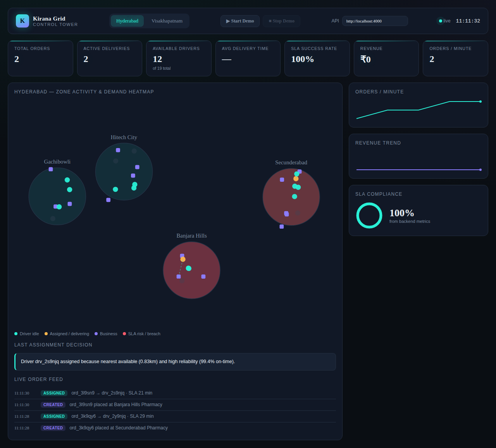
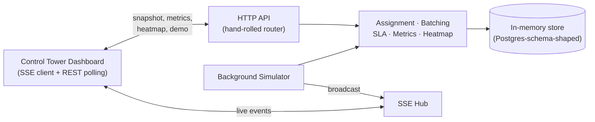

# 🛵 Kirana Grid — Real-Time Hyperlocal Logistics Control Platform

A live operations dashboard for a hyperlocal delivery network — real-time
order tracking, an **explainable** driver-assignment engine, delivery
route batching, SLA monitoring, and multi-city demand analytics. Zero
external dependencies, one Docker command to run anywhere.



---

## The problem

Hyperlocal delivery dispatch — matching an order to a driver, in real
time, across multiple zones and cities — is a genuinely hard systems
problem hiding behind a simple-looking map UI. Most portfolio projects in
this space stop at "nearest driver wins" and a static mock dashboard.
This one doesn't: the assignment engine weighs distance against a
driver's current load and reliability, explains *why* it picked who it
picked, and the whole dashboard is wired to a real event-driven backend —
nothing on screen is a static mock.

## The solution

A single Node.js process that:

- Runs a **weighted order-assignment engine** (distance + driver load +
  on-time reliability + vehicle fit) and generates a plain-English
  explanation for every decision
- Batches pending orders into multi-stop driver runs using
  **nearest-neighbor construction + 2-opt route improvement**
- Tracks the full **order lifecycle** (placed → assigned → picked up →
  in transit → delivered) with **SLA monitoring** that flags at-risk
  orders before they breach, not after
- Pushes every state change to a live dashboard over **Server-Sent
  Events** — no polling for what's happening right now
- Computes **live metrics** (SLA success rate, revenue, orders/minute,
  avg delivery time) and a **decaying demand heatmap** per zone
- Runs **multi-city, isolated** — every entity carries a city ID, and
  the SSE hub filters by it
- Ships as **one Docker command**, zero npm dependencies, in-memory store
  shaped exactly like the Postgres schema it's designed to sit on

## Features

| | |
|---|---|
| 🔴 **Real-time** | Server-Sent Events push order and driver updates live — verified end-to-end, not simulated in the browser |
| 🧠 **Explainable AI-style assignment** | Every dispatch decision comes with a generated reason: *"Driver X assigned because nearest available and high reliability"* |
| 📊 **Live metrics** | Total orders, active deliveries, SLA success rate, revenue, orders/minute — computed from real event counters |
| 🔥 **Demand heatmap** | Per-zone demand that decays over time, so it reflects *now*, not all-time totals |
| 🏙️ **Multi-city** | Fully isolated state per city, switchable live in the dashboard |
| 🎮 **Demo mode** | One click ramps up order frequency and driver availability for a live-feeling demo |
| 🐳 **One-command deploy** | `docker compose up` — zero dependencies means zero build step |

## Architecture



Full system design — event sequence diagrams, the assignment scoring
formula, heatmap decay logic, and why SSE over WebSockets — is in
[`docs/ARCHITECTURE.md`](./docs/ARCHITECTURE.md).

## Tech stack

**Backend:** Node.js (zero external dependencies — hand-rolled HTTP
router, SSE hub, in-memory data layer)
**Frontend:** Vanilla JS + SVG, no framework, no build step — persistent
DOM updates and `requestAnimationFrame`-driven interpolation for smooth
motion without extra network traffic
**Deployment:** Docker + Docker Compose, deployable to Render / Railway /
Fly.io / any VM with zero config beyond `PORT`

## Screenshots


*Live metrics, zone demand heatmap, driver positions, and the assignment
explanation panel — all backed by real backend state.*

## Setup

```bash
git clone <your-repo-url>
cd kirana-grid

# Option 1 — Docker (recommended)
docker compose up -d --build

# Option 2 — Node directly
npm install   # no-op today, zero deps
npm start
```

Open `http://localhost:4000/` — the dashboard and API are served from the
same process.

Full deployment instructions for Render, Railway, Fly.io, and bare Docker
are in [`docs/DEPLOYMENT.md`](./docs/DEPLOYMENT.md).

## Demo instructions

1. Open the dashboard, click **▶ Start Demo** in the top bar.
2. Watch the metrics row, the map, and the live order feed update in real
   time — every number is real, nothing is client-side mock data.
3. Watch for an `order_assigned` event and read the **"last assignment
   decision"** panel — that's the explainable-assignment feature in
   action.
4. Switch cities with the tabs — state is fully isolated per city.

A full walkthrough script (what to say, in what order, and how to answer
hard questions about it) is in
[`docs/DEMO_SCRIPT.md`](./docs/DEMO_SCRIPT.md).

## Documentation

| Doc | What's in it |
|---|---|
| [`docs/ARCHITECTURE.md`](./docs/ARCHITECTURE.md) | System design, event flow, assignment/batching/SLA/heatmap logic, mermaid diagrams |
| [`docs/DEPLOYMENT.md`](./docs/DEPLOYMENT.md) | Render, Railway, Fly.io, and Docker deployment steps |
| [`docs/DEMO_SCRIPT.md`](./docs/DEMO_SCRIPT.md) | A 3-minute walkthrough script, plus answers to hard questions |
| [`docs/PRODUCTION.md`](./docs/PRODUCTION.md) | Honest gap list: auth, rate limiting, logging, monitoring, and what it'd take to close each |
| [`docs/INTERVIEW_PREP.md`](./docs/INTERVIEW_PREP.md) | How to explain this project in interviews and system design rounds |
| [`docs/RESUME_LINKEDIN.md`](./docs/RESUME_LINKEDIN.md) | Resume bullets and LinkedIn post drafts |
| [`docs/CONTENT_KIT.md`](./docs/CONTENT_KIT.md) | Viral LinkedIn post, Twitter thread, video scripts, GitHub showcase copy, personal brand positioning |

## Known scope (said plainly, not hidden)

This is a portfolio-scale system, and it's more useful to say so directly
than to oversell it:

- **In-memory data store** — restarts wipe state. Shaped exactly like the
  Postgres schema it's meant to sit on, so the swap is one file, not a
  rewrite — but it is real work, not done yet.
- **No auth layer** — every endpoint is public today.
- **Single process** — no horizontal scaling, no queue-based decoupling
  yet. See `docs/PRODUCTION.md` for the concrete next steps.

What *is* solid: the assignment algorithm, the event-driven architecture,
the SLA/heatmap logic, and the fact that every claim above is something
you can `curl` and verify yourself.

## License

MIT
