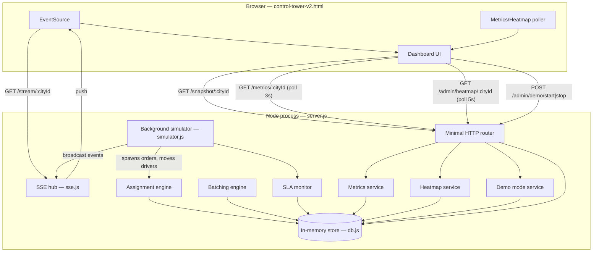
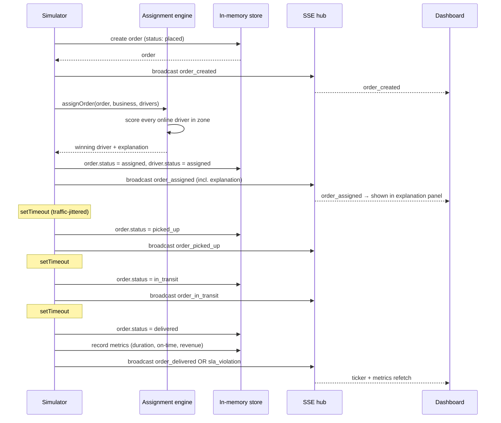

# Architecture

This describes the system as it's actually implemented, not an aspirational
target — every claim below maps to a specific file.

## System diagram



## Why SSE, not WebSockets

The dashboard only ever needs server→client push (order events, driver
positions) — it never sends real-time data back up. Server-Sent Events give
that with a plain HTTP response kept open (`sse.js`), no extra protocol, no
dependency, and it reconnects automatically in every browser without
custom logic. WebSockets would be the right call the moment the client
needs to push back (e.g. a driver app sending live location) — that's a
noted future step, not a limitation being worked around.

## Request flow: placing and fulfilling an order

The **simulator** (`simulator.js`) is the driver of activity — the same
code path a real "place order" API call would use is exercised either by
the simulator's `spawnOrder()` or by a real client hitting `POST /orders`
(`routes/orders.js`). Both call the same `assignOrder()` in
`services/assignment.js`, so the dashboard is always showing the actual
assignment engine, not a separate demo path.



## Order lifecycle

```
placed → assigned → picked_up → in_transit → delivered
                                              (or sla_violation if late)
```

Each transition is a real state change in `db.orders`, logged to
`db.orderEvents` (audit trail) and broadcast over SSE. There's no "fake"
status shown on the dashboard that isn't backed by an actual record.

## Driver states

```
offline → online (idle) → assigned (walking to pickup) → delivering (walking to dropoff) → online
```

Position updates happen every ~400ms in `simulator.js`'s `moveDrivers()`,
which steps each driver a fraction of the way toward its current target
(zone wander point when idle, pickup/dropoff when working). The dashboard
does **not** trust that step size for animation — it interpolates
client-side between ticks via `requestAnimationFrame` so motion looks
continuous at 60fps despite the network only updating 2-3 times/second.

## Assignment logic

`services/assignment.js` scores every online driver in the order's zone:

```
score = 0.55 × normalized_distance
      − 0.25 × (on_time_rate / 100)
      + 0.15 × current_batch_load
      + 8      (if vehicle type doesn't match the order category)
```

Lowest score wins. This is deliberately not "nearest driver" — a driver
0.3km away with a full load and a poor on-time record can lose to someone
1km away who's free and reliable. `explainAssignment()` turns the winning
driver's score components back into the sentence shown in the dashboard's
"last assignment decision" panel, picking the 1-2 factors that actually
drove the decision rather than dumping every number.

## Batching logic (`services/batching.js`)

For zones where orders queue up before a driver approaches (`/admin/batch/:zoneId`),
pending orders are grouped and routed with nearest-neighbor construction +
2-opt improvement — a lightweight route optimizer appropriate at
hyperlocal distances (under ~15 stops), rather than a full VRP solver.

## Metrics calculation (`services/metrics.js`)

Nothing is pushed on every tick — metrics are computed on read from
counters `simulator.js` updates as orders complete:

- **Total orders / orders-per-minute** — timestamped array, filtered to the
  trailing 60 seconds for the rate.
- **Avg delivery time** — rolling window of the last 100 delivery durations.
- **SLA success rate** — `1 − (breaches / delivered)`.
- **Revenue** — running per-city sum, incremented on each delivery.

The dashboard polls this endpoint every 3 seconds (plus an immediate
refetch triggered by key SSE events) rather than trying to derive these
numbers itself from the event stream — the backend is the source of
truth for aggregates, the event stream is for what's happening *right now*.

## Heatmap logic (`services/heatmap.js`)

Each order increments its zone's demand counter
(`db.recordOrderCreated`). Every 5 seconds, `db.decayZoneDemand()` multiplies
every zone's counter by 0.92 — so the heatmap reflects recent activity, not
an all-time total that only ever grows. The heatmap endpoint normalizes
each zone's counter against the busiest zone in that city (0–1), which the
dashboard maps to a cyan→amber→red fill.

## Multi-city isolation

Every entity (`zones`, `businesses`, `drivers`, `orders`) carries a
`city_id`. All simulator logic, metrics, and heatmap calculations filter by
it — there's no cross-city leakage. The SSE hub also filters by city:
subscribing with `cityId=city_hyd` only ever receives Hyderabad events; a
`cityId=all` subscription exists for a future ops-wide view.
